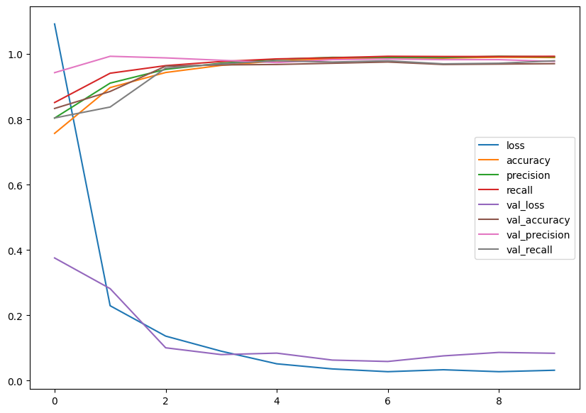
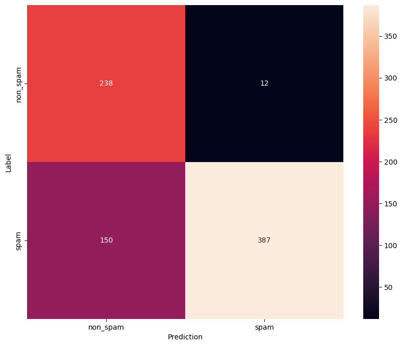

# Spam Image Classification Using Deep Learning
## Project Overview
This project aims to classify images as either spam or non-spam using a Convolutional Neural Network (CNN). Spam image classification is crucial for content moderation on platforms that allow user-generated content, ensuring a clean and reliable user experience.

## Features
 - Classifies images into Spam and Non-Spam categories.
 - Utilizes CNNs for image classification.
 - Preprocesses and augments image data for improved performance.
 - Provides an automated solution for detecting inappropriate or misleading images.

## How to Run?
You can either download the notebook to run it locally on your computer, or open it in Google Colab for a seamless, cloud-based execution.

## Model Architecture
This project uses a CNN architecture for image classification. The key components of the model are:

 - Convolutional Layers: Extract features from input images.
 - Max Pooling: Down-sample feature maps to reduce dimensionality.
 - Fully Connected Layers: Classify the image as spam or non-spam.

## Dataset
The dataset used in this project consists of labeled spam and non-spam images. It can be customized or expanded based on your requirements.

 - Spam Images: Images identified as spam or inappropriate for user-generated content.
 - Non-Spam Images: Clean and appropriate images for public viewing.

The dataset was split into a training and testing set using an 80-20 distribution.

## Evaluation and Results
After training for 10 epochs, the model achieved the following validation scores:
  - Loss: 0.0839
  - Accuracy: 0.9708
  - Precision: 0.9777
  - Recall: 0.9795

The following graph shows the loss curve and confusion matrix of the trained model: 

## Future Improvements
 - Incorporate more advanced data augmentation techniques to improve robustness.
 - Explore additional model architectures such as ResNet for improved accuracy.
 - Build a mobile application that allows users to easily identify and delete spam images from their devices using the trained model.

## Requirements
 - Python 3.7+
 - TensorFlow
 - NumPy
 - Matplotlib
 - Seaborn

## License
This project is licensed under the MIT License. See the LICENSE file for details.

